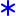
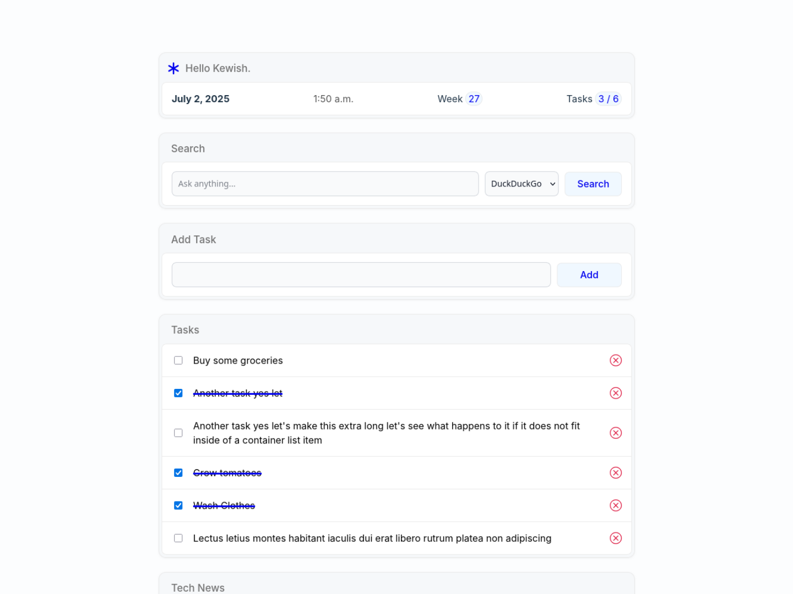

# New Tab Page

My own custom New Tab page for web browsers. I wanted a personalized page every
time I opened a new tab in a browser. I really enjoyed building this side project
with Vue 3 Single-File Components.

## Tech Stack

- Vue 3
- TypeScript
- CSS
- Vite

## Acknowledgements

- The [favicon](https://icons.getbootstrap.com/icons/asterisk/) used.
- SVG icons used: [X circle](https://icons.getbootstrap.com/icons/x-circle/) and [Plus circle](https://icons.getbootstrap.com/icons/plus-circle-fill/).
- [css-loaders.com](https://css-loaders.com/spinner/) - For the loading spinner.
- I appreciate the Vue [documentation](https://v2.vuejs.org/v2/examples/modal) for providing an [example modal](https://codesandbox.io/p/sandbox/github/vuejs/v2.vuejs.org/tree/master/src/v2/examples/vue-20-modal-component?file=%2Findex.html&from-embed) implementation.
- I made use of the [Hacker News API](https://github.com/HackerNews/API) for [fetching](https://github.com/jsuau/hacker-news-api) news headlines.

## License

[AGPL-3.0](/LICENSE)
